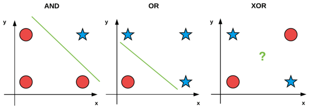
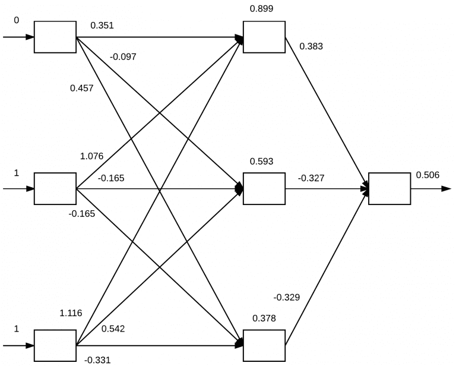

# Feedforward-Neural-Network-from-Scratch

n this project, we build a feedforward neural network with backpropagation from scratch using Python.
Inside this repository there is Python code to build a neural network and use the back propagation
algorithm to train it. Something like this is already built in to Keras / Tensorflow, but it's always
good to know what is happening behind the scenes.

We use this code to train a custom neural network on both the:
1. XOR Dataset
2. MINST Dataset

## Description
The preceptron is arguably the most simple of Artificial Neural Network (ANN) algorithms. However, a single layer Perceptron is unable
separate nonlinear data. This is shown in the figure below (from [Pyimagesearch](https://pyimagesearch.com/2021/05/06/implementing-the-perceptron-neural-network-with-python/?_ga=2.169932640.1119707357.1647809282-1931257770.1641919015)):  



As you can see, the AND / OR datasets can be separated via a line drawn between them. But that is impossible with the 
XOR dataset. So what do we do...?

Bring on the multi-layer Feedforward neural network with back propagation!

## Backpropagation
The backpropagation algorithm essentially consists of two phases:
1. The Forward Pass
2. THe Backward Pass

### The Forward Pass
This is where our inputs (raw pixel values, histograms, other pre-processed features) are passed through the network layers and 
predictions come from the output (aka the propagation pass). The inputs work forward through the network layers by applying a series of dot products
and activations until the output layer is reached.

A visual example of the forward pass can be seen below:



### The Backward Pass
This is where the gradient of the loss function at the prediction (last) layer is computed and used to recursively apply 
the chain rule to update the network layer weights.

Python code for the forward and backward pass can be found in the 'neuralnet.py' script.

## Classification Results:
### XOR Results
For this 'dataset' there are only 4 data points. Shown here:
```buildoutcfg
1. [0, 0]
2. [1, 1]
3. [1, 0]
4. [0, 1]
```
Also with this 'dataset' we don't set aside a test set, we use the same 4 points that we
used for training. This is just to prove that it is possible to separate this 'dataset'.

The output to the terminal will look similar to below (epochs = 20000, alpha = 0.5): 

```buildoutcfg
[INFO] epoch=1, loss=0.4993325
[INFO] epoch=100, loss=0.4731022
[INFO] epoch=200, loss=0.3174045
                ...
[INFO] epoch=19900, loss=0.0000004
[INFO] epoch=20000, loss=0.0000004
[INFO] data=[0 0], ground-truth=0, pred=0.0004, step=0
[INFO] data=[0 1], ground-truth=1, pred=0.9997, step=1
[INFO] data=[1 0], ground-truth=1, pred=0.9997, step=1
[INFO] data=[1 1], ground-truth=0, pred=0.0007, step=0
```
We can see from the above that it IS possible to classify correctly the XOR 'dataset',
as long as we have one or more hidden layers.

### MINST Results
For this example, we use a subset of the popular MINST dataset (which is built into the
scikit-learn library). It includes ~1,800 grayscale images of digits 0-9. They are
8x8 images and when flattene they are a 64 dimension vector.

We set aside 25% of the images for testing which means we train off of the other 75%.

The output to the terminal will look similar to below (epochs = 800, alpha = 0.1): 

```buildoutcfg
[INFO] epoch=1, loss=586.4966039
[INFO] epoch=100, loss=0.0495874
[INFO] epoch=200, loss=0.0080397
[INFO] epoch=300, loss=0.0030552
[INFO] epoch=400, loss=0.0015725
[INFO] epoch=500, loss=0.0009475
[INFO] epoch=600, loss=0.0006291
[INFO] epoch=700, loss=0.0004462
[INFO] epoch=800, loss=0.0003319
[INFO] evaluating network...
              precision    recall  f1-score   support

           0       0.98      1.00      0.99        42
           1       0.94      0.96      0.95        50
           2       0.97      0.97      0.97        38
           3       0.97      0.97      0.97        38
           4       0.93      1.00      0.96        40
           5       1.00      0.93      0.97        46
           6       1.00      1.00      1.00        48
           7       1.00      1.00      1.00        50
           8       0.98      0.89      0.93        46
           9       0.94      0.98      0.96        52

    accuracy                           0.97       450
   macro avg       0.97      0.97      0.97       450
weighted avg       0.97      0.97      0.97       450
```

We can see that using a feedforward neural netowrk with backpropagation that we can
achieve pretty good classification results for the MINST dataset.
## Getting Started

### Dependencies

See requirements.txt

### Installing

#### Clone the project:
```
git clone git@github.com:reedajohns/k-NN-Image-Classifier-Hot-Dog-or-Not-Hot-Dog.git
```

### Executing program

Open terminal and run either command:
```
python mnist_example.py
python xor_example.py
```

## Authors

Contributors names and contact info

Reed Johnson (https://www.linkedin.com/in/reed-a-johnson/)

## Version History

* 0.1
    * Initial Release

## License

This project is licensed under the GNU GENERAL PUBLIC License - see the LICENSE.md file for details

## Acknowledgments

Inspiration, code snippets, etc.
* [Pyimagesearch](https://pyimagesearch.com/2021/05/06/implementing-the-perceptron-neural-network-with-python/?_ga=2.169932640.1119707357.1647809282-1931257770.1641919015)